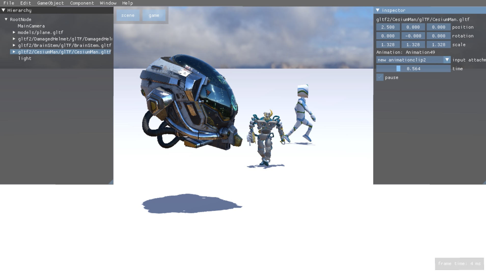
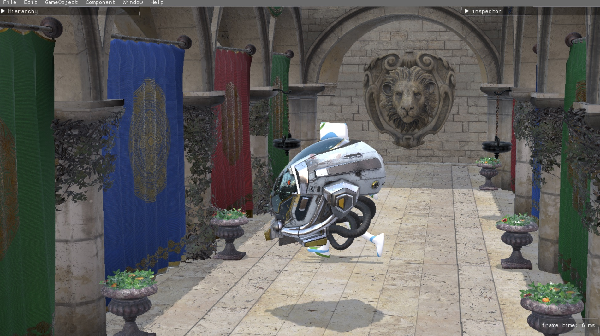

# ShitRenderEngine
a simple test engine

support gltf2 model
support skeleton, skin animation, deferred shading, IBL, pbr, CSM

Supported graphic api:
* vulkan1.3
* opengl4.6

Supported platform :
* windows

## build
use compileshaders.py to compile glsl to spirv
It can compile shader files in assets folder "assets/shaders/glsl" to spirv

usage: call glslc to compile glsl to spirv [-h] [-T T] [-S [S [S ...]]]

optional arguments:

  -h, --help      show this help message and exit

  -T T            target environment, values are {vulkan,vulkan1.1,vulkan1.2,opengl}, default is opengl

  -S [S [S ...]]  source files, if no files provided, than all shaders in shader path will be compiled

example

    py compileshaders.py -T vulkan1.1
    py compileshaders.py -T vulkan1.1 -S [folder or file in assets/shaders/glsl]

build project
    
    cmake -B build
    
    
examples

    
    
    
